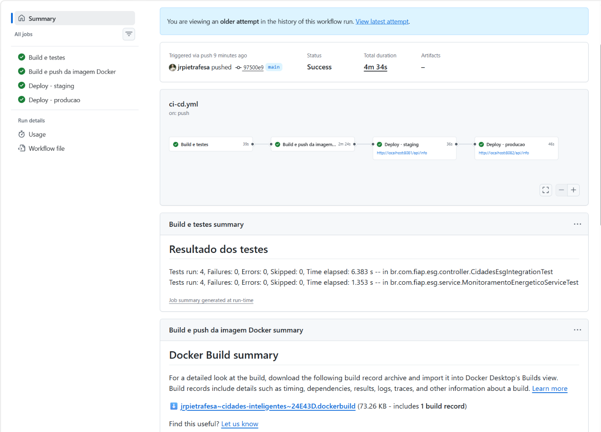
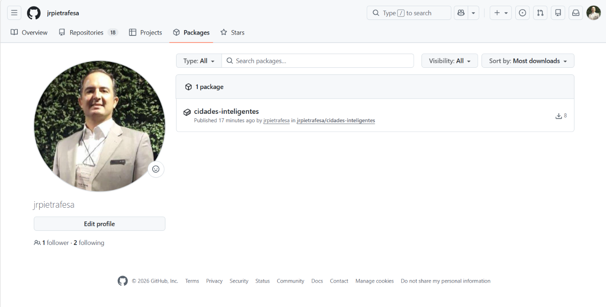
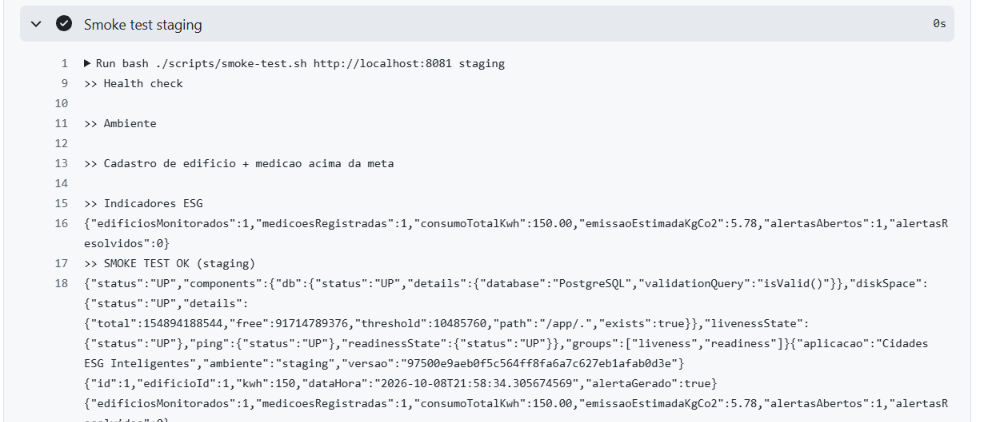
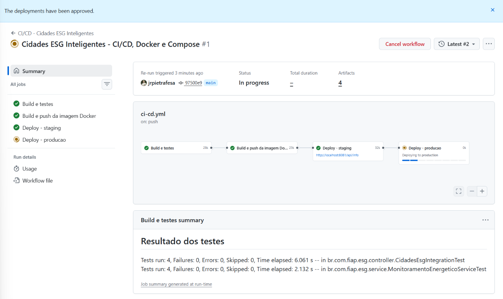
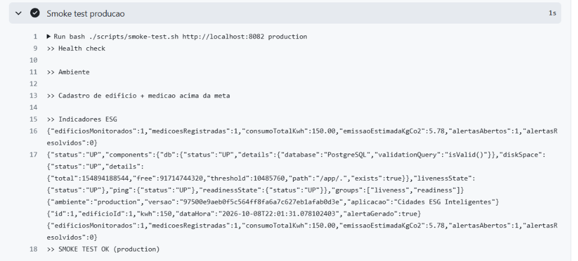

# Projeto - Cidades ESG Inteligentes

API REST em **Java 21 + Spring Boot 3** para monitoramento do consumo de energia de edifícios públicos
(escolas, hospitais, prédios administrativos). Cada leitura enviada pelos medidores inteligentes é
somada ao consumo do dia; quando o total ultrapassa a **meta ESG** do edifício, a API abre um alerta
automaticamente. O endpoint de indicadores entrega consumo total, emissão estimada de CO₂ e alertas —
o pilar **Ambiental (E)** do ESG aplicado à gestão urbana.

O projeto foi preparado para um ciclo DevOps completo: testes automatizados, imagem Docker,
orquestração com Docker Compose e pipeline CI/CD no **GitHub Actions** com deploy em **staging** e **produção**.

**Integrante:** Sidney — RM: _______

---

## Endpoints

| Método | Rota | Descrição |
|---|---|---|
| POST | `/api/edificios` | Cadastra edifício e sua meta diária (kWh) |
| GET | `/api/edificios` / `/api/edificios/{id}` | Lista / consulta edifícios |
| POST | `/api/edificios/{id}/medicoes` | Registra leitura; retorna `alertaGerado` |
| GET | `/api/edificios/{id}/medicoes` | Histórico de leituras |
| GET | `/api/alertas` | Alertas abertos |
| PATCH | `/api/alertas/{id}/resolver` | Resolve um alerta |
| GET | `/api/indicadores` | Indicadores ESG (kWh, kgCO₂, alertas) |
| GET | `/api/info` | Nome do ambiente e versão em execução |
| GET | `/actuator/health` | Health check (usado pelo Docker e pelo pipeline) |

---

## Como executar localmente com Docker

Pré-requisitos: Docker Desktop (ou Docker Engine) com Compose v2.

```bash
# 1. Criar o arquivo de variáveis
cp .env.example .env          # ajuste DB_PASSWORD se quiser

# 2. Build da imagem e subida de API + PostgreSQL
docker compose up -d --build

# 3. Acompanhar
docker compose ps
docker compose logs -f app

# 4. Testar
curl http://localhost:8080/actuator/health
curl http://localhost:8080/api/info
bash scripts/seed.sh http://localhost:8080      # dados de exemplo

# 5. Derrubar (use -v para apagar também o volume do banco)
docker compose down
```

### Simular staging e produção na mesma máquina

O mesmo `docker-compose.yml` sobe ambientes isolados, cada um com seu projeto, rede, volume e porta:

```bash
export DB_PASSWORD=minha_senha
bash scripts/deploy.sh staging        # http://localhost:8081
bash scripts/deploy.sh production     # http://localhost:8082
bash scripts/smoke-test.sh http://localhost:8081 staging
bash scripts/smoke-test.sh http://localhost:8082 production
```

### Executar os testes sem Docker

```bash
mvn verify     # testes unitários (Mockito) + integração (Spring Boot + H2)
```

---

## Pipeline CI/CD

**Ferramenta:** GitHub Actions — arquivo `.github/workflows/ci-cd.yml`.
**Gatilhos:** push na `main`, pull request para a `main` e execução manual (`workflow_dispatch`).

```
push main ─► [1] Build e testes ─► [2] Imagem Docker (GHCR) ─► [3] Deploy staging ─► [4] Deploy produção
                 mvn verify            build + push               compose + smoke       aprovação manual
                                                                   test                   + compose + smoke test
pull request ─► [1] apenas (valida o código antes do merge)
```

| Etapa | O que faz |
|---|---|
| **1. Build e testes** | JDK 21 com cache Maven; `mvn -B verify` compila, executa os 8 testes (4 unitários + 4 de integração) e gera o JAR. Relatórios do Surefire e o JAR são publicados como artefatos; o resumo aparece na página do run. |
| **2. Imagem Docker** | Build multi-stage com Buildx e cache do GitHub; push para o GitHub Container Registry com as tags `<sha curto>` e `latest`. |
| **3. Deploy staging** | Environment `staging`. Faz pull da imagem exata do commit, sobe API + PostgreSQL com `deploy/.env.staging` (porta 8081) e aguarda os health checks (`--wait`). Em seguida o smoke test valida health, ambiente (`staging`) e o fluxo de negócio (medição acima da meta gera alerta). Logs e status dos containers viram artefato `evidencias-staging`. |
| **4. Deploy produção** | Só roda depois de staging verde e na `main`. Environment `production` com **revisor obrigatório**: o pipeline pausa até a aprovação. Mesmo processo com `deploy/.env.production` (porta 8082) e smoke test esperando `production`. |

**Configuração no GitHub (uma vez):**
1. *Settings → Environments*: criar `staging` e `production`; em `production`, marcar **Required reviewers**.
2. Em cada environment, criar o secret `DB_PASSWORD` (se ausente, o pipeline usa uma senha padrão de demonstração).
3. *Settings → Actions → General → Workflow permissions*: **Read and write**, para o push da imagem no GHCR.
4. Opcional: cadastrar um runner self-hosted e criar a variável `DEPLOY_RUNNER` com o label dele — assim os ambientes continuam no ar depois do job. Sem ela, o deploy acontece no runner do GitHub, que é descartado ao final (as evidências ficam nos artefatos).

---

## Containerização

```dockerfile
# ============================================================
# Cidades ESG Inteligentes - imagem multi-stage
# Estagio 1: build com Maven | Estagio 2: runtime somente JRE
# ============================================================

# ---------- Estagio 1: build ----------
FROM maven:3.9-eclipse-temurin-21 AS build
WORKDIR /workspace

# Copia apenas o pom primeiro para aproveitar o cache de dependencias
COPY pom.xml .
RUN mvn -B -q dependency:go-offline

COPY src ./src
# Os testes ja rodam no pipeline (job build-test); aqui so empacotamos
RUN mvn -B -q package -DskipTests

# ---------- Estagio 2: runtime ----------
FROM eclipse-temurin:21-jre-alpine

ARG APP_VERSION=dev
LABEL org.opencontainers.image.title="cidades-esg-inteligentes" \
      org.opencontainers.image.description="API de monitoramento energetico ESG" \
      org.opencontainers.image.version="${APP_VERSION}"

# Usuario sem privilegios (boa pratica de seguranca)
RUN addgroup -S esg && adduser -S esg -G esg
WORKDIR /app

COPY --from=build --chown=esg:esg /workspace/target/cidades-esg.jar app.jar

ENV APP_VERSION=${APP_VERSION} \
    TZ=America/Sao_Paulo \
    JAVA_OPTS="-XX:MaxRAMPercentage=75 -XX:+UseG1GC"

USER esg
EXPOSE 8080

HEALTHCHECK --interval=15s --timeout=5s --start-period=40s --retries=5 \
  CMD wget -qO- http://localhost:8080/actuator/health | grep -q '"status":"UP"' || exit 1

ENTRYPOINT ["sh", "-c", "exec java $JAVA_OPTS -jar /app/app.jar"]
```

**Estratégias adotadas**

- **Multi-stage build:** o estágio Maven compila; a imagem final leva só a JRE Alpine e o JAR — bem menor e sem ferramentas de build.
- **Cache de dependências:** o `pom.xml` é copiado antes do código, então `dependency:go-offline` só roda de novo quando as dependências mudam.
- **Usuário sem privilégios** (`esg`) e `.dockerignore` para não levar `target/`, `.git` ou arquivos `.env` para a imagem.
- **HEALTHCHECK** no `/actuator/health`: o Compose usa para `--wait` e o pipeline só segue com o container saudável.
- **JVM ajustada para container:** `MaxRAMPercentage` respeita o limite de memória do container; configurável por `JAVA_OPTS`.

**Orquestração (`docker-compose.yml`)**

| Recurso | Uso |
|---|---|
| Serviços | `app` (API) e `db` (PostgreSQL 16) |
| Volume | `pgdata` persiste os dados do banco; cada ambiente (`-p esg-staging`, `-p esg-production`) tem o seu |
| Redes | `backend` **interna** (banco inacessível de fora); `frontend` só para publicar a porta da API |
| Variáveis | `.env` local, `deploy/.env.staging` e `deploy/.env.production`; senha vem de secret/shell, nunca do repositório |
| Dependência | `app` só inicia quando o `db` passa no `pg_isready` |

---

## Prints do funcionamento

> Capturas feitas a partir do primeiro run do pipeline no GitHub. Salvar as imagens em `docs/prints/`.

| # | Evidência | Arquivo |
|---|---|---|
| 1 | Run completo com os 4 jobs verdes (aba *Actions*) |  |
| 2 | Job *Build e testes* com o resumo dos testes |  |
| 3 | Imagem publicada em *Packages* (GHCR) |  |
| 4 | Job *Deploy - staging* com smoke test OK |  |
| 5 | Aprovação manual do deploy de produção |  |
| 6 | Job *Deploy - producao* com smoke test OK |  |
| 7 | `/api/info` em staging (8081) e produção (8082) |  |
| 8 | `docker compose ps` com containers *healthy* |  |

Logs completos de cada deploy: artefatos `evidencias-staging` e `evidencias-production` do run.
Link do run: _______

---

## Tecnologias utilizadas

- **Linguagem/Framework:** Java 21, Spring Boot 3.3 (Web, Data JPA, Validation, Actuator)
- **Banco de dados:** PostgreSQL 16 (execução) e H2 (testes)
- **Testes:** JUnit 5, Mockito, AssertJ, Spring MockMvc
- **Build:** Maven 3.9
- **Containers:** Docker (multi-stage, Alpine JRE), Docker Compose v2
- **CI/CD:** GitHub Actions, GitHub Environments (aprovação manual), GitHub Container Registry
- **Scripts:** Bash (deploy, smoke test, seed)

---

## Estrutura do projeto

```
cidades-esg-inteligentes/
├── Dockerfile
├── docker-compose.yml
├── .dockerignore
├── .env.example
├── pom.xml
├── README.md
├── .github/workflows/ci-cd.yml
├── deploy/                 # variáveis de staging e produção
├── scripts/                # deploy.sh, smoke-test.sh, seed.sh
├── docs/                   # documentação PDF e prints
└── src/
    ├── main/java/br/com/fiap/esg/   # model, repository, service, controller, dto, exception
    └── test/java/br/com/fiap/esg/   # testes unitários e de integração
```

---

## Checklist de entrega

| Item | OK |
|---|---|
| Projeto compactado em .ZIP com estrutura organizada | ☑ |
| Dockerfile funcional | ☑ |
| docker-compose.yml ou arquivos Kubernetes | ☑ |
| Pipeline com etapas de build, teste e deploy | ☑ |
| README.md com instruções e prints | ☐ (inserir prints em `docs/prints/`) |
| Documentação técnica com evidências (PDF ou PPT) | ☐ (inserir prints no PDF) |
| Deploy realizado nos ambientes staging e produção | ☐ (após o primeiro run no GitHub) |
